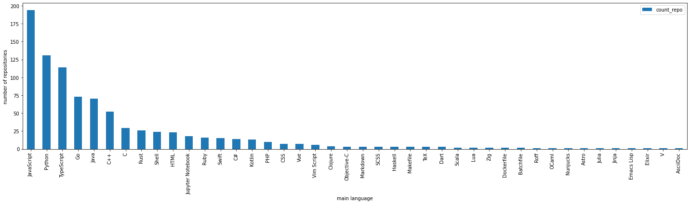

```python
import pandas as pd
import numpy as np
%matplotlib inline
import matplotlib.pyplot as plt
plt.rc('figure', figsize=(14,6))
```


```python
dados = pd.read_csv('famous_repositories.csv', sep=';')
```

# RQ01


```python
x = dados['age in days'].values
a = np.array(x)
result = plt.hist(x, bins=11, color='pink', edgecolor='black')
plt.axvline(np.median(a), color='red', linestyle='dashed', linewidth=2)
plt.xlabel("idade do repositório em dias")
plt.ylabel("repositórios")

plt.show()

ax = dados['age in days'].plot.kde(bw_method=0.3, color="r")
max_salario = dados['age in days'].median()
ax.annotate('Mediana: {}'.format(max_salario), xy=(max_salario, 0), xytext=(max_salario+700, 0.00009),
            arrowprops=dict(facecolor='black', shrink=0.05))
plt.xlabel("idade do repositório em dias")
plt.axvline(max_salario, linestyle='dashed', linewidth=2, color='b')
plt.show()

dados.boxplot('age in days', vert=False)
```


    

    


    

    


    <AxesSubplot:>


    

    


```python
median = dados['age in days'].median()
print("A mediana da idade em dias por repositório é {}".format(median))
```

    A mediana da idade em dias por repositório é 2707.0


# RQ02


```python
x = dados['pr merged'].values
a = np.array(x)
result = plt.hist(x, bins=11, color='c', edgecolor='black')
plt.axvline(np.median(a), color='b', linestyle='dashed', linewidth=2)
plt.xlabel("número de pull request's fundidos (merged)")
plt.ylabel("repositórios")
plt.show()

ax = dados['pr merged'].plot.kde(bw_method=0.3, color="r")
max_salario = dados['pr merged'].median()
ax.annotate('Mediana: {}'.format(max_salario), xy=(max_salario, 0), xytext=(max_salario+9000, 0.000001),
            arrowprops=dict(facecolor='black', shrink=0.05))
plt.xlabel("número de pull request's fundidos (merged)")
plt.axvline(max_salario, linestyle='dashed', linewidth=2, color='b')
plt.show()

dados.boxplot('pr merged', vert=False)
```


    

    


    

    


    <AxesSubplot:>


    

    


```python
median = dados['pr merged'].median()
print("A mediana da quantidade de pull request's fundidos por repositório é {}".format(median))
```

    A mediana da quantidade de pull request's fundidos por repositório é 461.0


# RQ03


```python
x = dados['releases'].values
a = np.array(x)
result = plt.hist(x, bins=11, color='c', edgecolor='black')
plt.axvline(np.median(a), color='b', linestyle='dashed', linewidth=3)
plt.xlabel("número de releases")
plt.ylabel("repositórios")
plt.show()

ax = dados['releases'].plot.kde(bw_method=0.3, color="r")
max_salario = dados['releases'].median()
ax.annotate('Mediana: {}'.format(max_salario), xy=(max_salario, 0), xytext=(max_salario+200, 0.003),
            arrowprops=dict(facecolor='black', shrink=0.05))
plt.xlabel("número de releases")
plt.axvline(max_salario, linestyle='dashed', linewidth=2, color='b')
plt.show()

dados.boxplot('releases', vert=False)
```


    

    


    

    


    <AxesSubplot:>


    

    


```python
median = dados['releases'].median()
print("A mediana da quantidade de releases por repositório é {}".format(median))
```

    A mediana da quantidade de releases por repositório é 22.5


# RQ04


```python
x = dados['minutes w/o update'].values
a = np.array(x)
result = plt.hist(x, bins=11, color='pink',edgecolor='black')
plt.axvline(np.median(a), color='b', linestyle='dashed', linewidth=2)
plt.xlabel("minutos sem update")
plt.ylabel("repositórios")
plt.show()

ax = dados['minutes w/o update'].plot.kde(bw_method=0.3, color="r")
max_salario = dados['minutes w/o update'].median()
ax.annotate('Mediana: {}'.format(max_salario), xy=(max_salario, 0), xytext=(max_salario+30, 0.005),
            arrowprops=dict(facecolor='black', shrink=0.05))
plt.xlabel("minutos sem update")
plt.axvline(max_salario, linestyle='dashed', linewidth=2, color='b')
plt.show()

dados.boxplot('minutes w/o update', vert=False)
```


    

    


    

    


    <AxesSubplot:>


    

    


```python
median = dados['minutes w/o update'].median()
print("A mediana da quantidade de minutos sem um update por repositório é {}".format(median))
```

    A mediana da quantidade de minutos sem um update por repositório é 69.93878385833334


# RQ05


```python
agrupamento = dados.groupby('main language')
```


```python
df = agrupamento['name'].count()
df = pd.DataFrame(df)
df.sort_values(inplace = True, by = 'name', ascending=False)
df = df.rename(columns = {'name':'count_repo'})
ax = df.plot.bar(figsize=(20,6))
# criar uma figura a partir do gráfico
fig = ax.get_figure()
ax.set_xlabel("main language")
ax.set_ylabel("number of repositories")
plt.tight_layout()
# salvar a figura como um arquivo de imagem
fig.savefig('grafico.jpeg')
plt.show()
```


    

    


## As 10 linguagens de programação mais populares atualmente, de acordo com o índice TIOBE de março de 2023, são:"
### 1  Python
### 2  Java
### 3  C 
### 4  C++
### 5  JavaScript
### 6  TypeScript
### 7  PHP
### 8  R
### 9  Swift
### 10 Objective-C

# RQ06


```python
x = dados['% closed issues'].values
a = np.array(x)
result = plt.hist(x, bins=11, color='pink',edgecolor='black')
plt.axvline(np.median(a), color='b', linestyle='dashed', linewidth=2)
plt.xlabel("porcentagem de issues fechadas")
plt.ylabel("repositórios")
plt.show()

ax = dados['% closed issues'].plot.kde(bw_method=0.3, color="r")
max_salario = dados['% closed issues'].median()
ax.annotate('Mediana: {}'.format(max_salario), xy=(max_salario, 0), xytext=(max_salario+14, 0.006),
            arrowprops=dict(facecolor='black', shrink=0.05))
plt.xlabel("porcentagem de isssues fechadas")
plt.axvline(max_salario, linestyle='dashed', linewidth=2, color='b')
plt.show()

dados.boxplot('% closed issues', vert=False)
```


    

    


    

    


    <AxesSubplot:>


    

    


```python
median = dados['% closed issues'].median()
print("A mediana da porcentagem de issues fechadas por repositório é {}".format(median))
```

    A mediana da porcentagem de issues fechadas por repositório é 86.0

